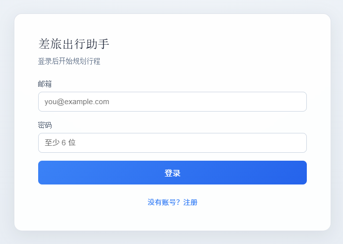
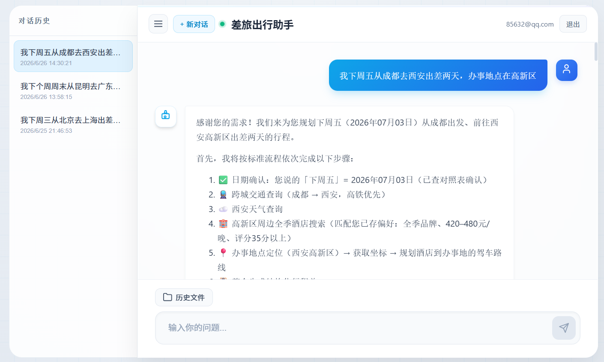
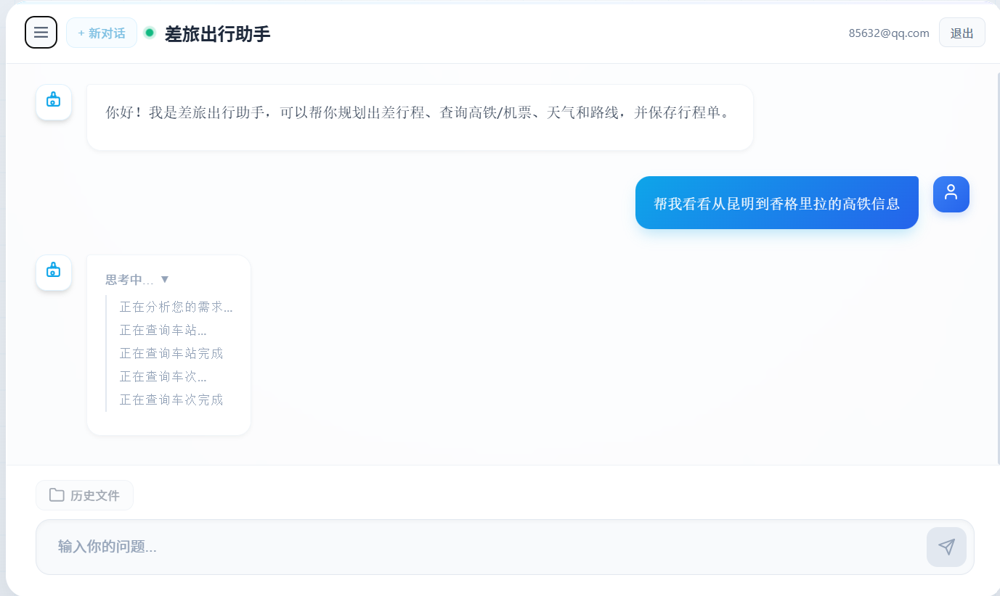
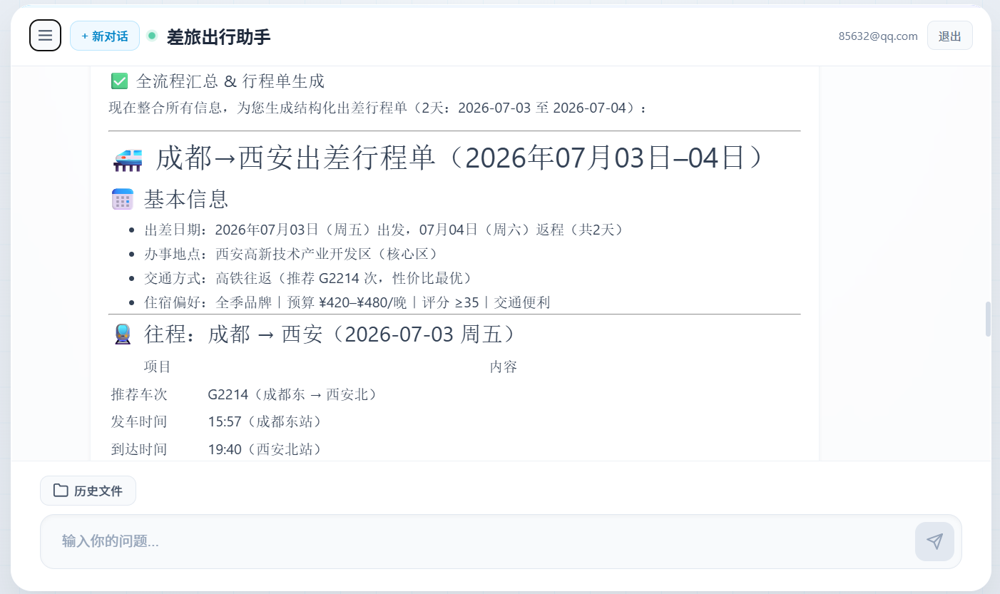
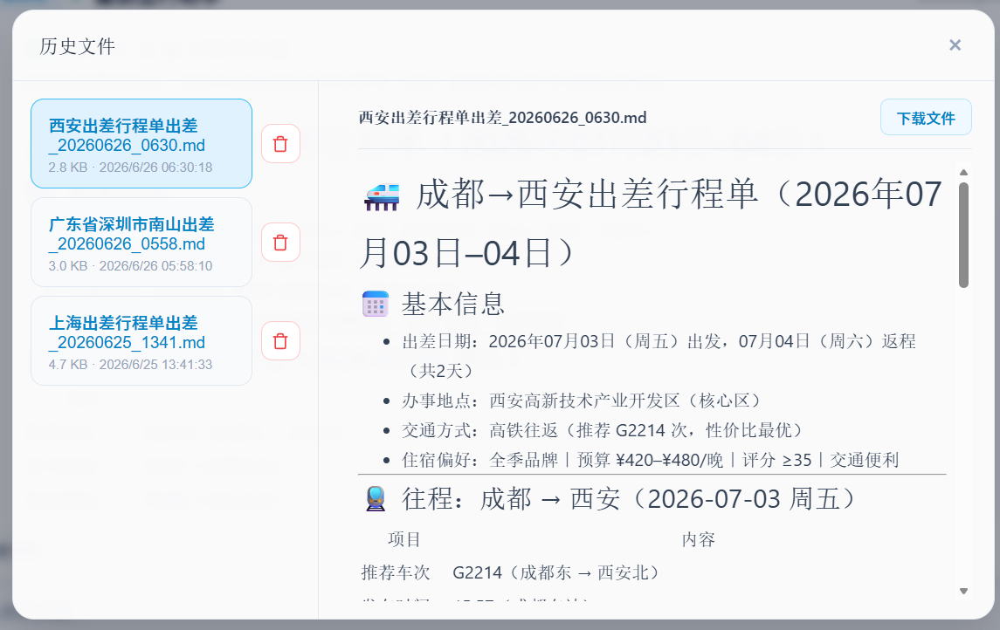

# 差旅出行助手

基于 **LangGraph + MCP** 的智能差旅规划助手。用户通过 Web 对话即可查询天气、高铁/火车、航班与地图路线，并生成可保存的 Markdown 行程单。

## 功能特性

- **多源出行查询**：12306 火车、飞常准航班、高德地图路线与周边搜索
- **天气查询**：目的地天气预报（OpenWeather）
- **智能行程规划**：根据出发/到达、日期、偏好自动组合交通与住宿建议
- **用户偏好记忆**：跨会话记住饮食、车型等偏好
- **行程单导出**：将确认后的方案保存为 Markdown 文件，可在前端预览与下载
- **多轮对话**：支持会话历史、登录注册（JWT）

## 效果展示











## 技术栈

| 层级 | 技术 |
|------|------|
| Agent | Python 3.11、LangGraph、LangChain、通义千问（DashScope） |
| MCP | 本地 stdio（天气、文件写入）+ 魔搭 HTTP（高德、12306、飞常准） |
| 后端 API | FastAPI、SQLite（对话 checkpoint / 用户偏好） |
| 前端 | Vue 3、Vite、Markdown 渲染 |
| 部署 | Docker（nginx 反代 + 单容器多进程） |

## 前置条件

- **Python 3.11+**（本地开发）
- **Node.js 20+**（仅本地前端开发时需要）
- **通义千问 API Key**：[DashScope 控制台](https://dashscope.console.aliyun.com/) 获取
- **魔搭 MCP 服务**：在 [ModelScope 魔搭](https://modelscope.cn/) 部署高德地图、12306、飞常准 MCP，获取各自的 HTTP URL
- **OpenWeather API Key**（可选）：本地天气 MCP 使用，见 [OpenWeather](https://openweathermap.org/api)

## 配置

### 1. 环境变量

```bash
cp .env.example .env
```

编辑 `.env`，至少填写：

| 变量 | 必填 | 说明 |
|------|------|------|
| `DASHSCOPE_API_KEY` | 是 | 通义千问 API Key |
| `MODEL` | 否 | 默认 `qwen-plus` |
| `JWT_SECRET` | 生产必填 | JWT 签名密钥，请使用随机长字符串 |
| `OPENWEATHER_API_KEY` | 否 | 天气 MCP |
| `DATA_DIR` | 否 | 数据目录，默认 `./data` |
| `ENV` | 否 | 设为 `production` 启用生产模式 |

### 2. MCP 服务器配置

```bash
cp servers_config.example.json servers_config.json
```

在 `servers_config.json` 中填入你在魔搭平台上部署后获得的 MCP URL。**请勿将真实 URL 提交到公开仓库**（该文件已加入 `.gitignore`）。

本地 MCP（`weather`、`write`）无需额外配置，随 Python 进程以 stdio 方式启动。

## 本地开发

前后端分离，适合调试与改 UI。

**终端 1 — 后端 API**

```bash
python -m venv .venv

# Windows
.venv\Scripts\activate

# macOS / Linux
# source .venv/bin/activate

pip install -r requirements.txt
python travel_agent.py --api
```

后端默认：`http://localhost:8001`

**终端 2 — 前端**

```bash
cd front/mcp_agent
npm install
npm run dev
```

前端默认：`http://localhost:5173`（API 地址见 `front/mcp_agent/.env.development`）

浏览器打开前端，注册/登录后即可与「差旅出行助手」对话。

### CLI 调试（可选）

```bash
python travel_agent.py
```

在终端直接与 Agent 对话，无需前端。

## Docker 运行

适合本地一键体验或与生产环境一致的单端口访问。

```bash
cp .env.example .env          # 填写密钥
cp servers_config.example.json servers_config.json   # 填写 MCP URL
docker compose up --build
```

浏览器访问：**http://localhost:8080**

- 前端静态资源由 nginx 提供
- `/api/` 反代至后端 `travel_agent.py --api`（见 `nginx.conf`、`start.sh`）
- 用户数据持久化在 `./data` 卷

## 项目结构

```
travel_assistant/
├── travel_agent.py          # 差旅 Agent 主入口（API / CLI）
├── api_server.py            # 原通用 Agent API（可选，:8000）
├── weather_server.py        # 天气 MCP（stdio）
├── write_server.py          # 行程文件写入 MCP（stdio）
├── auth.py                  # 用户注册 / 登录 / JWT
├── conversation_store.py    # 对话会话存储
├── user_preference.py       # 用户偏好
├── servers_config.example.json
├── docker-compose.yml
├── Dockerfile
├── front/mcp_agent/         # Vue 3 前端
└── docs/                    # README 截图目录
```

## 部署说明

README 中的 Docker 部分足以让任何人**在本地复现**完整环境。

若需部署到 Sealos 等云平台，建议将实例名、域名、卷挂载等**运维细节**写在本地 `deploy/sealos.md`（已 gitignore，不进入公开仓库），避免暴露个人基础设施信息。

生产环境请务必设置 `JWT_SECRET`，并将 `DATA_DIR` 指向持久化卷（Docker 默认为 `/app/data`）。

## 常见问题

**MCP 连接失败**

- 检查 `servers_config.json` 中的 URL 是否正确、魔搭服务是否仍在运行
- 确认本机可访问 `mcp.api-inference.modelscope.net`

**未找到 DASHSCOPE_API_KEY**

- 确认项目根目录存在 `.env` 且已填写 `DASHSCOPE_API_KEY`

**前端连不上后端**

- 本地开发：确认后端已启动，且 `front/mcp_agent/.env.development` 中 `VITE_API_BASE=http://localhost:8001`
- Docker：前端构建时 `VITE_API_BASE` 留空，由 nginx 同域反代 `/api`

**12306 / 航班查不到合适车次**

- Agent 会将「明天、下周一」等口语转为具体日期；若结果异常，可在对话中补充更精确的出发站/车型要求

## License

本项目仅供学习与交流使用。
